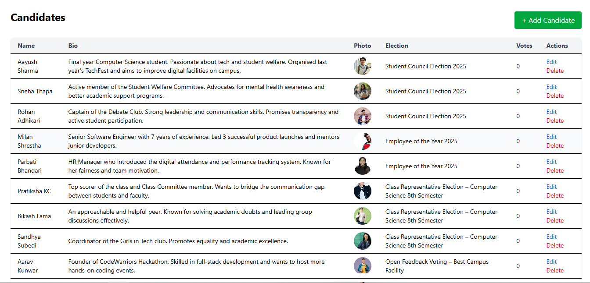

# 🗳️ Online Voting System (Core PHP MVC OOP)

This is a solo internship project built using **Core PHP** with **MVC architecture** and **Object-Oriented Programming (OOP)** principles. The application allows registered users to cast votes in a secure and structured manner, and it provides administrative features for managing elections, candidates, and voters.

---

## 🚀 Features

### 👥 User Module
- Voter Registration and Login
- Secure Voting (One vote per voter)
- View Candidate Profiles
- Voting Confirmation and Feedback

### 🛠️ Admin Panel
- Login for Admin
- Manage Voters (Add/Edit/Delete)
- Manage Candidates (Add/Edit/Delete with image upload)
- Manage Elections (Create/Activate/Close)
- View Voting Results
- Voter Turnout Statistics

---

## ⚙️ Technical Stack

- **Language:** PHP (Core)
- **Architecture:** MVC (Model-View-Controller)
- **Paradigm:** Object-Oriented Programming (OOP)
- **Database:** MySQL
- **Styling:** HTML, CSS, Bootstrap
- **Validation & Alerts:** JavaScript (client-side)

---

## 📂 Project Structure
```bash
OnlineVotingSystem/
├── app/
│   ├── controllers/       # Handles request logic
│   ├── models/            # Database operations
│   ├── views/             # HTML + PHP view files
├── assets/
│   ├── images/            # Candidate images
├── config/
│   └── config.php         # DB and base URL settings
├── migrations/            # migration files
├── core                   # Base controller, model, routes
├── index.php              # entry file
└── README.md


## 🛡️ Security Considerations

- Passwords are hashed using `password_hash()`
- Input validation and sanitization using `filter_input()` and prepared statements
- Voters can only vote once per election


## 📸 Screenshots 

### Landing Page

### Dashboard


### Create Candidate Page


### Voters Homepage


## ⚙️ Setup Instructions

### 1. Clone the repository

```bash
git clone https://github.com/your-username/online-voting-system.git


🧑‍💻 Author
Parbati Bhandari
🎓 BSc.CSIT Graduate
🌍 Patan Multiple Campus, Nepal
🔗 LinkedIn • GitHub